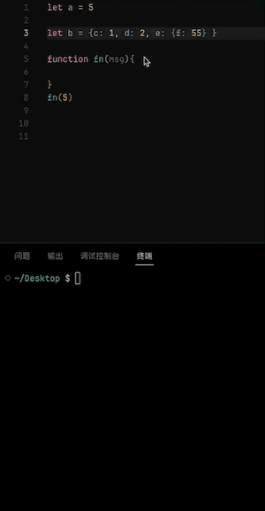

# Tree Log

一个自动生成树形格式的 console.log 语句的插件。默认的树头是随机 Emoji 符号，可以自定义。

## 特性

你可以选择变量后使用快捷键 `alt` + `c` 自动生成控制台语句，也可以使用 `ctrl` + `alt` + `c` 删除文件的控制台语句。

你还可以使用 `命令面板`，搜索 `Add Tree Log` 来生成它们，或者搜索 `Delete Tree Log` 来删除。

当然，你也可以在选择变量后右键，选择 `Tree Log` 进行操作。

## 设置

你可以通过 `Settings.json` 添加文本，来自定义树头（命令面板 -> 首选项：打开设置 (JSON)）

比如:

* `tree-log.suffix`: "a custom text"

