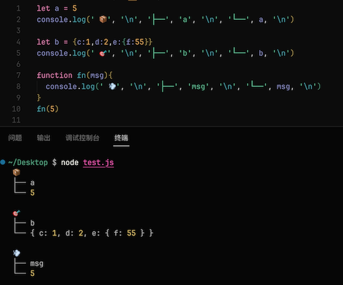

# Tree Log

[中文文档](/README-zh.md)

A plugin that automatically generates console.log statements in tree format. The default tree header is a random emoji, which can be customized.

## Features

You can select the variable and use the shortcut key `alt`+`c` to automatically generate the console statement, or use `ctrl`+`alt`+`c` to delete the console statement of the file.

You can also use the `Command Palette`, search for `Add Tree Log` to generate them, and `Delete Tree Log` to delete.

Of course, you can also right-click and select `Tree Log` to operate it after selecting the variable.

## Settings

You can customize the tree head by adding text to settings.json (Command Palette -> Preferences: Open Settings (JSON))

For example:

* `tree-log.suffix`: "a custom text"

